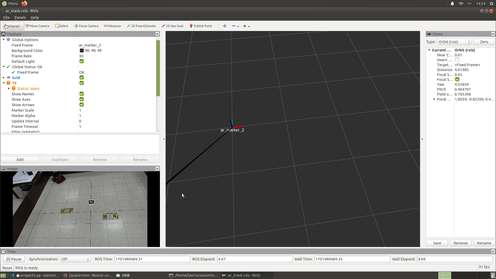
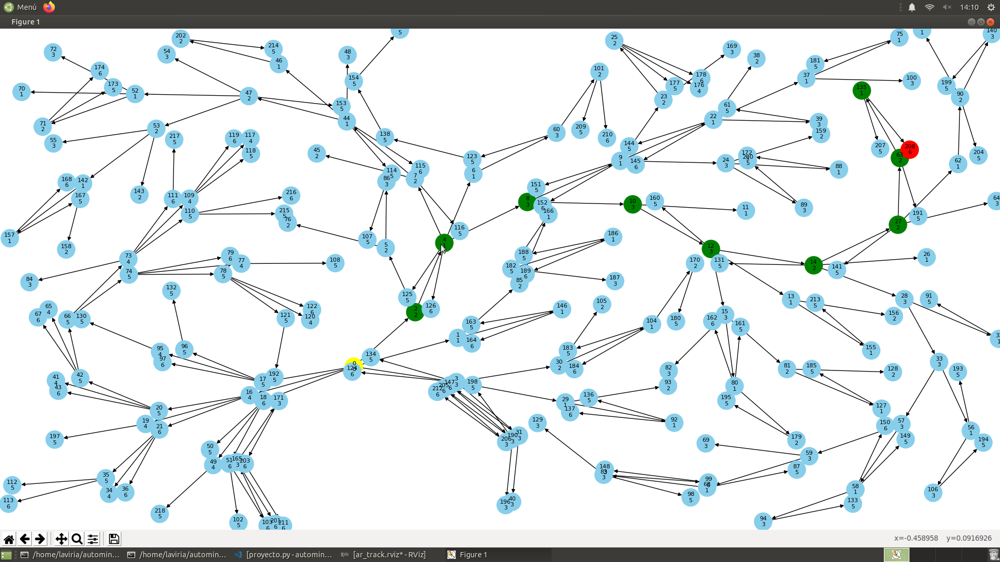

## RRT AUTOMINY
Para usar el algoritmo RRT con el autominy, se deben correr dos paquetes. <br>

El primer paquete es ```my_camera``` para correrlo, ejecutar ```roslaunch my_camera alvar_usb.launch``` obteniendo la siguiente imagen para la deteccion de los tags: <br><br>


El segundo paquete es ```proyecto_robotica```, correrlo con la instruccion ```roslaunch proyecto_robotica rrt.launch```, al correrlo se obtendra la ruta mas cercana al punto final como en la siguiente imagen: <br><br>


Una vez que se cierre el mapa de la ruta, el Autominy comenzara a realizar los movimientos necesarios para llegar al punto final. 

> **Nota:** Para correr estos codigos, es necesario tener linux con ROS, y crear los paquetes de la camara y del proyecto, corriendo ambos al mismo tiempo.