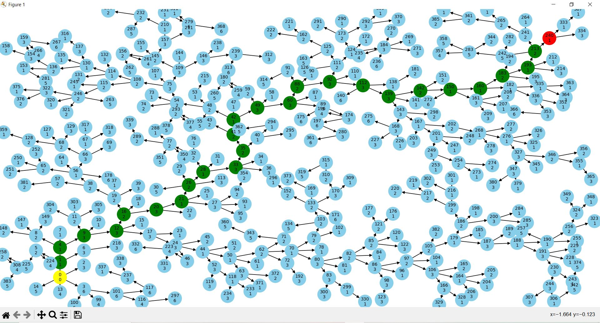

## RRT IDEAL
Correr con ```python proyecto.py``` obteniendo un resultado como el siguiente. <br><br>


> **Nota:** Este codigo no funciona con el autominy, solo es el concepto de como debe funcionar el algoritmo RRT.